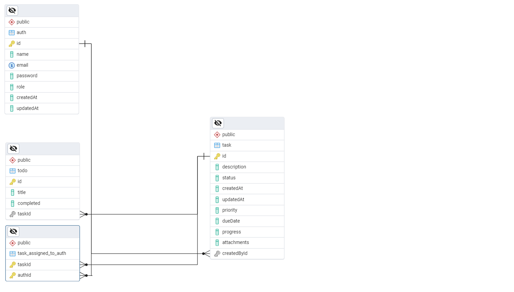

# Task Manager

## Description
Task Manager is a project built using TypeScript and NestJS to manage tasks and their lifecycle. It includes user authentication, task assignment, and progress tracking. The system also provides functionalities to export task data into an Excel sheet.

---

## Features
- User registration and authentication using JWT.
- Task creation, updating, and deletion.
- Dashboard metrics for task statuses (pending, in-progress, completed, overdue).
- Export tasks and their details to an Excel sheet.
- Role-based access control (admin and member roles).

---

## Endpoints Summary

### Authentication
| Method | Endpoint           | Description                  | Access         |
|--------|---------------------|------------------------------|----------------|
| POST   | `/auth/register`    | Register a new user          | Public         |
| POST   | `/auth/login`       | Log in and retrieve a JWT    | Public         |

---

### Tasks
| Method | Endpoint             | Description                   | Access                  |
|--------|-----------------------|-------------------------------|-------------------------|
| POST   | `/tasks`             | Create a new task             | Authenticated users     |
| GET    | `/tasks`             | Retrieve all tasks            | Authenticated users     |
| GET    | `/tasks/:id`         | Retrieve task details by ID   | Task creator or assignee|
| PUT    | `/tasks/:id`         | Update a task's details       | Task creator or assignee|
| DELETE | `/tasks/:id`         | Delete a task                 | Task creator or admin   |
| GET    | `/tasks/dashboard`   | Retrieve task metrics         | Authenticated users     |

---

### Todos
| Method | Endpoint                           | Description                     | Access                  |
|--------|-------------------------------------|---------------------------------|-------------------------|
| POST   | `/tasks/:taskId/todos`             | Add a new todo to a task        | Task creator or assignee|
| PUT    | `/tasks/:taskId/todos/:todoId`     | Update the status of a todo     | Task creator or assignee|

---

### Excel Export
| Method | Endpoint        | Description                       | Access |
|--------|------------------|-----------------------------------|--------|
| GET    | `/tasks/export` | Export all task details to Excel  | Admin  |

---

## Authentication & Authorization

1. **JWT Authentication**
   - Endpoints are secured using JWT tokens.
   - Tokens are generated upon login and verified using a secret key.

2. **Role-based Access Control**
   - **Admin:** Can create, update, delete tasks, and export task data.
   - **Member:** Can manage their tasks and assigned tasks.

3. **Authorization Guard**
   - Validates the token and attaches user details to the request.

---

## Excel Export Functionality

The `exportTasksToExcel` method generates a detailed Excel sheet with the following structure:

| Task ID | Description               | Status      | Priority | Due Date   | Progress (%) | Created By   | Assigned To         | Checklist Completion |
|---------|---------------------------|-------------|----------|------------|--------------|--------------|---------------------|----------------------|
| 1       | Complete project docs     | In Progress | High     | 2025-04-20 | 50%          | John Doe     | Jane Smith, Mike D. | 2/4 done            |
| 2       | Prepare presentation      | Completed   | Medium   | 2025-04-15 | 100%         | Alice Brown  | Bob White           | 5/5 done            |
| 3       | Update software versions  | Pending     | Low      | 2025-04-25 | 0%           | Charlie Lee  | None                | 0/3 done            |

**Column Descriptions:**
- **Task ID:** Unique identifier of the task.
- **Description:** Task description provided during creation.
- **Status:** Current status of the task (e.g., pending, in-progress, completed).
- **Priority:** Task priority (e.g., high, medium, low).
- **Due Date:** Deadline for completing the task (formatted as YYYY-MM-DD).
- **Progress (%):** Task progress as a percentage.
- **Created By:** Name of the user who created the task.
- **Assigned To:** Names of users assigned to the task (comma-separated).
- **Checklist Completion:** Progress of the task's checklist (e.g., 3/5 done).

---

## Database Schema
The database management system (DBMS) used is **PostgreSQL**, and the Object Relational Mapper (ORM) is **TypeORM**. Below is the database schema diagram:



---

## Project Flow Diagram
```plaintext
+-----------------+       +-------------------+       +-------------------+
| User Registers  +----->| User Authenticates+-----> | Task Management   |
| or Logs In      |       | (JWT Token)       |       | (Create, Update, |
+-----------------+       +-------------------+       | Delete Tasks)     |
                                                       +-------------------+
                                                              |
                                                              v
                                                +--------------------------+
                                                | Dashboard Metrics        |
                                                | (Task Stats & Progress)  |
                                                +--------------------------+
                                                              |
                                                              v
                                                +--------------------------+
                                                | Export to Excel          |
                                                +--------------------------+
```

