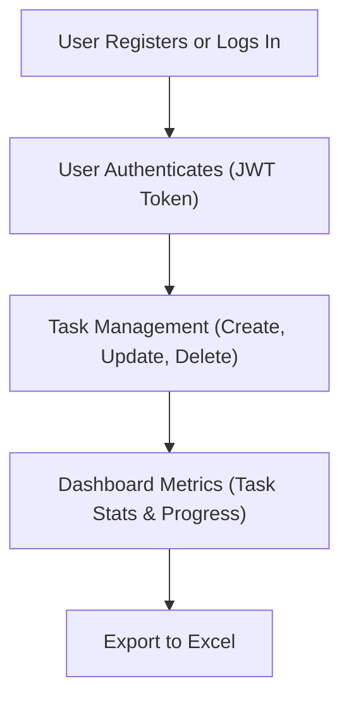

# 📝 Task Manager

## 📌 Description
Task Manager is a project built with **TypeScript** and **NestJS** to manage tasks and their lifecycle. It includes:
- User authentication
- Task assignment
- Progress tracking
- Excel export support

---

## 🚀 Features
- 🔐 User registration & login with JWT authentication
- ✅ Create, update, delete tasks
- 📊 Dashboard metrics for task statuses (Pending, In Progress, Completed, Overdue)
- 📥 Export tasks to Excel
- 👥 Role-based access (Admin & Member)
- 🐳 Fully Dockerized using Docker & Docker Compose

---

## 📡 API Endpoints

### 🔐 Authentication
| Method | Endpoint         | Description               | Access  |
|--------|------------------|---------------------------|---------|
| POST   | `/auth/register` | Register a new user       | Public  |
| POST   | `/auth/login`    | Log in & get JWT          | Public  |

---

### 📋 Tasks
| Method | Endpoint             | Description                 | Access                    |
|--------|----------------------|-----------------------------|---------------------------|
| POST   | `/tasks`             | Create a new task           | Authenticated users       |
| GET    | `/tasks`             | Retrieve all tasks          | Authenticated users       |
| GET    | `/tasks/:id`         | Get task by ID              | Task creator or assignee  |
| PUT    | `/tasks/:id`         | Update task                 | Task creator or assignee  |
| DELETE | `/tasks/:id`         | Delete task                 | Task creator or admin     |
| GET    | `/tasks/dashboard`   | Get task metrics            | Authenticated users       |

---

### 🧾 Todos
| Method | Endpoint                            | Description             | Access                   |
|--------|-------------------------------------|-------------------------|--------------------------|
| POST   | `/tasks/:taskId/todos`              | Add a todo to a task    | Task creator or assignee |
| PUT    | `/tasks/:taskId/todos/:todoId`      | Update a todo's status  | Task creator or assignee |

---

### 📤 Excel Export
| Method | Endpoint         | Description                   | Access |
|--------|------------------|-------------------------------|--------|
| GET    | `/tasks/export`  | Export tasks to Excel         | Admin  |

---

## 🛡️ Authentication & Authorization

### 🔑 JWT Authentication
- Tokens generated on login
- Verified via a secret key

### 🎭 Role-Based Access
- 👑 **Admin**: Full access, including export
- 🙋 **Member**: Can manage their own tasks

### 🧰 Authorization Guard
- Verifies JWT & injects user into request

---

## 📈 Excel Export Structure

| Task ID | Description               | Status      | Priority | Due Date   | Progress (%) | Created By   | Assigned To         | Checklist Completion |
|---------|---------------------------|-------------|----------|------------|--------------|--------------|---------------------|----------------------|
| 1       | Complete project docs     | In Progress | High     | 2025-04-20 | 50%          | John Doe     | Jane Smith, Mike D. | 2/4 done             |
| 2       | Prepare presentation      | Completed   | Medium   | 2025-04-15 | 100%         | Alice Brown  | Bob White           | 5/5 done             |
| 3       | Update software versions  | Pending     | Low      | 2025-04-25 | 0%           | Charlie Lee  | None                | 0/3 done             |

🔍 **Column Descriptions**
- **Task ID**: Unique identifier  
- **Description**: Task content  
- **Status**: Current state  
- **Priority**: Importance level  
- **Due Date**: Deadline  
- **Progress**: Completion %  
- **Created By**: Task creator  
- **Assigned To**: Users assigned  
- **Checklist**: Progress of subtasks

---

## 🗄️ Database Schema

- DB: **PostgreSQL**
- ORM: **TypeORM**

📷 **Diagram:**

---

## 🔄 Project Flow Diagram

